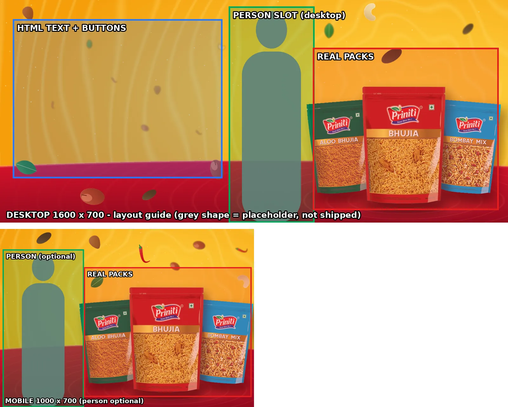

# Lifestyle people for the Priniti banners

The 13 banners (`tools/banners/banners.json`) are built without people. **No AI image generation is available in the
development environment, so no person has been generated, drawn or faked.** The build is ready to take approved
people: add a cut-out, rebuild, done.



The grey shape in the guide is a placeholder for layout only; it is never shipped.

## What is needed for each person

| Requirement | Detail |
|---|---|
| Format | **Transparent PNG** (real alpha channel; no white or coloured background) |
| Size | At least **1400 px tall**; waist-up or three-quarter body, cropped at the bottom edge |
| Framing | **One person**, portrait: fits the slot about 270 px wide on the 1600 x 700 desktop banner |
| Direction | Facing or gesturing towards the **right** (where the packs are) |
| Hands | Natural, five fingers, nothing distorted; may hold **plain food or a cup** (a cookie, a tea cup, a plate of ladoos) |
| Packaging | **Must not hold, touch or show any Priniti pack** or any other branded packaging. The real packs are composited separately, beside the person |
| Look | Realistic Indian person suited to the category; warm daylight; clothes that work on yellow/orange (avoid yellow and red tops) |
| Rights | Written commercial-use rights: your own AI tool licence, a stock licence, or a model release from your own shoot. Record the source and licence in `banners.json` |

The fastest route is often Priniti's own campaign photography. If your agency holds the original model cut-outs (for
example the people in the reference creatives) **and Priniti has the usage rights**, supply those PNGs.

## How to add a person (one banner)

1. Save the PNG as `tools/banners/people/<banner-id>.png`.
2. In `tools/banners/banners.json`, set the banner's `person`:
   ```json
   "person": { "file": "tools/banners/people/home-namkeen.png", "source": "Agency shoot 2026", "license": "Model release on file", "mobile": false }
   ```
   `mobile: true` also adds the person to the phone/tablet image (packs get smaller there, so leave it `false` unless
   the result is checked).
3. Run `npm run banners` and `npm test`.

The build stops if the PNG has no transparency, if the source or licence is missing, if a banner with a person has
more than 3 packs in the main row (products stay dominant), or if the person would overlap any pack by even one
pixel. Packs, prices and products are untouched by this step.

## Brief and AI prompt per banner

Each prompt asks for **the person only, without any packaging**. Run it in a tool you hold a commercial licence for,
remove the background, and check hands and face before approving.

Common prompt ending (append to every prompt): *"photorealistic, studio-lit, natural skin, natural hands with five
fingers, plain warm-coloured background for easy cut-out, no text, no logos, no packaging, no products in hand unless
stated, waist-up portrait, looking slightly to the right"*

| Banner | Products beside the person | Person brief | AI prompt (person only) |
|---|---|---|---|
| home-namkeen | Bhujia, Aloo Bhujia, Bombay Mix | Joyful young Indian woman, festive-casual kurta, pointing towards the packs | "Smiling Indian woman in her twenties, coral cotton kurta, pointing with her right hand to the right, cheerful" |
| home-chips | Classic Salted, Cream 'n' Onion, Masala Punch | Young man, casual party mood, excited expression | "Excited Indian man in his twenties, white t-shirt and denim jacket, open-palm gesture to the right" |
| home-cookies | Ajwain, Jeera, Kaju Cookies | Woman enjoying tea-time with a cookie | "Indian woman in her thirties holding a cup of chai and a plain round cookie, relaxed smile" |
| category-indian-traditional-namkeen | Navratan, Kaju Mixture, Bhujia (max 3 with a person) | Family/elder snacking feel | "Cheerful Indian grandmother in a cotton saree, warm smile, gesturing to the right" |
| category-potato-chips | 3 of the 5 chips flavours | Teen/college party snacking | "Indian college student, blue hoodie, laughing, thumbs-up with the left hand" |
| category-charchare-sticks | Mast Masala, Tangy Tomato | Energetic youth | "Energetic Indian teenager, teal t-shirt, playful surprised expression, pointing to the right" |
| category-popcorn | Butter Salted | Movie night | "Indian young woman in a cosy navy sweater, excited movie-night expression, holding a plain paper bowl of popcorn" |
| category-puffs-fryums | 3 of the 5 puffs | Kids/family fun | "Happy Indian child aged 8 to 10, bright t-shirt, cheerful wave" |
| category-ringo-star-rings | Tangy Tomato | Playful kid | "Playful Indian boy aged 9, blue cap, big smile, both hands raised in excitement" |
| category-rusk | Rusk | Morning tea | "Indian man in his forties, morning light, holding a cup of tea, calm smile" |
| category-sweets | 2 to 3 boxes + tins in front | Festive celebration | "Smiling Indian woman in a festive silk saree with jhumkas, holding a plate of besan ladoos" |
| category-cookies | 3 cookie packs | Tea-time at home | "Indian woman in her thirties at tea-time, holding a plain round cookie, warm smile" |
| category-donut-cakes | Choco Vanilla, Strawberry Vanilla | Dessert/celebration, kid or teen | "Happy Indian girl aged 12, pink top, delighted expression, hands clasped" |

People stay secondary: they sit in their own slot, never in front of the packs, and the packs remain the largest
element of the banner.
